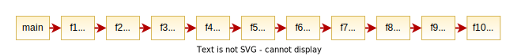
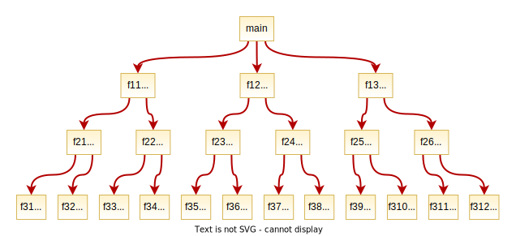

# TppFaaS: Modeling Serverless Functions Invocations via Temporal Point Processes

Code of the paper [TppFaaS: Modeling Serverless Functions Invocations via Temporal Point Processes](https://ieeexplore.ieee.org/document/9684420) by the authors Markus Steinbach, Anshul Jindal, Mohak Chadha, Michael Gerndt, and Shajulin Benedict.

## Description

---


We introduce our developed system called _TppFaaS_, for modeling function invocations in FaaS applications using temporal point processes (TPPs). It is designed for applications running on the [_OpenWhisk_](https://openwhisk.apache.org/) FaaS platform, that underneath uses a Kubernetes cluster. For modeling, trace data of application functions is collected and is used for training TPP models. Based on these models, predictions are carried out. Additionally, for creating the dataset for training TPP models, we created a component within TppFaaS called _Sampler_. The Sampler is an automated pipeline for creating simulated FaaS applications by specifying configuration parameters. Here, an application is a function composition in which sleep commands simulate the execution times of the functions following a distribution. This simulated application is deployed on the OpenWhisk FaaS platform. For generating the traces, Sampler sends user requests to the deployed application (Step 1 in the figure above) executed by OpenWhisk. The [_OpenTelemetry_ library](https://opentelemetry.io/) instruments the application's functions and exports a span for each function invocation to the post-processing service [_Trace Collector_](https://github.com/maSteinbach/owtracecollector) (Step 2). The Trace Collector enriches the span with meta-information retrieved from the OpenWhisk API (Step 3) and subsequently exports it to [_Zipkin_](https://zipkin.io/) (Step 4). Here, the spans are aggregated into traces and then fetched by the Sampler, which transforms the traces into a data format suitable for the TPP models (Step 5). Once a trace dataset is generated, we split it into a training and test dataset. We use the training data to optimize the parameters of the TPP model (Steps 6-7), which we then evaluate using the test data (Step 8).

## Prerequisite: OpenWhisk

---

OpenWhisk deployed on Kubernetes is a prerequisite. If it is not yet available, detailed instructions for deploying OpenWhisk on Kubernetes is provided [here](https://github.com/apache/openwhisk-deploy-kube).

## Deployment & Configuration

---

Set up TppFaaS by executing the following steps:

1. Deploy Zipkin in your Kubernetes cluster. A simple manifest is provided in `infra/zipkinot.yaml`, which defines a Zipkin instance storing all the data in-memory. To handle high workloads and guarantee persistency, a Zipkin instance using Elasticsearch as storage is recommended. How to define Zipkin using Elasticsearch is described [here](https://github.com/openzipkin/zipkin/tree/master/zipkin-server#configuration).
2. Configure and deploy the _Trace Collector_ service in your Kubernetes cluster as described [here](https://github.com/maSteinbach/owtracecollector#configuration-and-deployment).
3. If necessary, change the OpenWhisk and Trace Collector configuration parameters in `apps/config.yaml`. These parameters are accessed inside the serverless functions to send requests to the OpenWhisk and Trace Collector API.
4. Configure the parameters in `sampler/config.yaml` which are accessed by the _Sampler_ to send requests to OpenWhisk and to fetch the traces from Zipkin.

## Generating Datasets: Sampler

---

The Sampler is a command-line tool for generating trace datasets used to train and evaluate TPP models. It creates a dataset by sending `n` requests to the FaaS application's `main` function at irregular time intervals. The time intervals between requests are drawn from a continuous uniform distribution with an interval specified by the `lower (-l)` and `upper bound (-u)` arguments. The arguments are set by the user, who thus determines the load on OpenWisk and, indirectly, the number of cold starts. Another feature of the Sampler is performing requests in batches, pausing requesting after each batch for a user-specified duration. The `batch size` and the `pause duration` are specified with the `-b` and `-w` arguments, respectively. To simplify the trace dataset generation process, the Sampler is an end-to-end pipeline that contains all the necessary steps for data generation, such as deploying the application. The output is a dataset in `/data` consisting of n traces whose format is compatible with training a TPP model.

### Prerequisites

* Python 3.9
* Serverless Framework 2.19.0
* Node.js

### Usage

`pip install --file requirements.txt`

`cd sampler/bin`

`bash sample.sh -d sequence -n 1000 -l 2.0 -u 6.0`

`bash sample.sh -d sequence -n 1000 -l 2.0 -u 6.0 -b 50 -w 120 -e 2 -m 3 -r`

Run it as a background process and write the error & info logs to a file:

`bash sample.sh -d sequence -n 1000 -l 2.0 -u 6.0 &> run.log &`

* `-d` = directory name of the Serverless app
* `-n` = number of traces to sample
* `-l` = lower bound of inter-request duration in seconds
* `-u` = upper bound of inter-request duration in seconds
* `-b` = batch size
* `-w` = pause duration after each batch in seconds
* `-r` = randomized function duration (sleep command's duration is drawn from a gamma distribution)
* `-e` = number of function duration anomalies in each trace
* `-m` = number of missing function anomalies in each trace

### Data Format

The data format is based on the format of the paper [Intensity-Free Learning of Temporal Point Processes](https://github.com/shchur/ifl-tpp).

```json
{
    "sequences": [
        {
            "arrival_times": [
                1620831914775,
                1620831915292,
                1620831916205,
                ...
            ],
            "marks": [
                2,
                0,
                1,
                ...
            ],
            "wait_times": [
                169,
                138,
                4319,
                ...
            ],
            "init_times": [
                141,
                197,
                186,
                ...
            ]
        }, 
        ...
    ],
    "mapping": {
        "sequence-dev-f1": 0,
        "sequence-dev-f2": 1,
        "sequence-dev-main": 2,
        ...
    }
}
```

## Default FaaS Applications

---

Multiple simulated FaaS applications are provided for data generation in `/apps`. All applications are implemented using the [_Serverless Framework_](https://www.serverless.com/). Sleep commands simulate the execution times of the FaaS functions. The command's duration is either fixed, e.g. 300 ms, or is drawn from a gamma distribution with a mean value of 300 ms at each invocation. The images below show the structure of the applications `sequence` ...



... and `tree_large` ...



... where, e.g., `300ms` specifies either the sleep command's fixed duration or the mean of the gamma distribution.

## Build your own FaaS Application

---

The template in `apps/template` guides the creation of custom simulated FaaS applications.

## TPP Model

---

We used the TPP model _LogNormMix_ from the [code](https://github.com/shchur/ifl-tpp) by Shchur, Biloš and Günnemann. After installing the dependencies with `pip install --file requirements.txt`, one can train and test the model interactively in `models/ifltpp/interactive.ipynb`. Also, setting `mae_loss = True` predicts the time of the next invocation as a scalar value instead of a probability distribution. In our paper, we refer to this model as _TruncNorm_.
